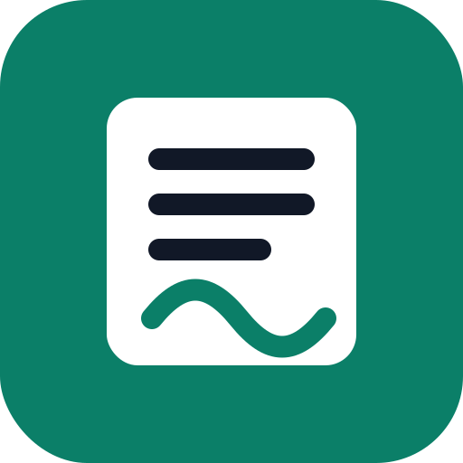
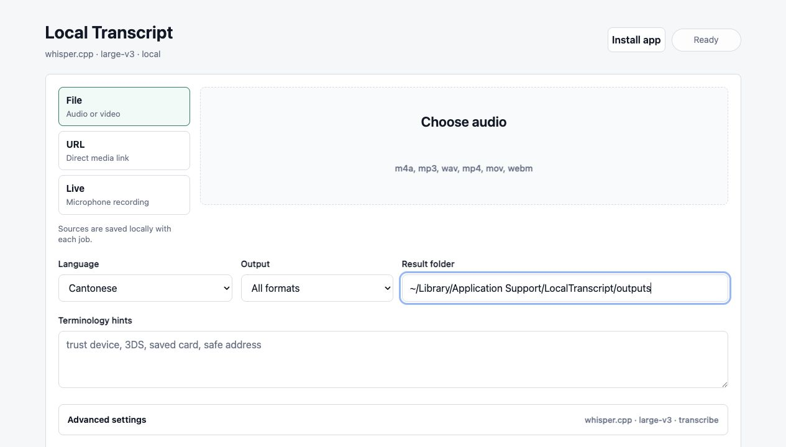

# Local Transcript

<p align="center">
  
</p>

<p align="center">
  
</p>

Local Transcript is a private macOS transcription app. It runs on your Mac, uses
`whisper.cpp` with the full `large-v3` model, and saves transcripts to your local
disk.

Open the app here after setup:

```text
http://127.0.0.1:5057/
```

## What This App Does

Use Local Transcript to turn audio or video into text without sending the file to
a cloud transcription service.

It supports:

- File transcription: upload an audio or video file from your Mac.
- URL transcription: paste a direct media URL and let the app download it locally.
- Live recording: record from your microphone in the browser, save that audio
  locally, then transcribe it.
- High-accuracy transcription using the full `large-v3` Whisper model.
- Local transcript output in common formats such as text, SRT, VTT, JSON, and CSV.
- Progress, ETA, pause, continue, and terminate controls while a job is running.
- A browser-based app UI that can be added to the macOS Dock.

The app is designed for local use. Your source files, recordings, transcripts,
and logs stay on the Mac running the app.

## What You Need

- macOS.
- Enough free disk space for the runtime and models. The `large-v3` model alone
  is about 2.9 GB.
- Internet access for the first setup so the script can download dependencies and
  models.
- Microphone permission in the browser if you want to use Live recording.

The setup script checks for `git`, `cmake`, `curl`, and `python3`. If Homebrew is
installed, it can install missing command-line dependencies for you.

## First-Time Workflow

For a first-time user, the intended flow is:

1. Get the project folder onto the Mac.
2. Open Terminal in the project folder.
3. Run the setup script:

   ```sh
   work/setup_new_mac.sh
   ```

4. Wait for setup to finish. The first run can take a while because it builds
   `whisper.cpp` and downloads the full `large-v3` model.
5. Confirm the script prints:

   ```text
   Local Transcript is ready.
   Open http://127.0.0.1:5057/
   ```

6. Open `http://127.0.0.1:5057/`.
7. Click `Install app` in the UI and add it to the Dock from Safari or Chrome.
8. Run a first transcript with a small audio file to confirm everything is ready.

After that, the app starts automatically through the local macOS service. The
friend should be able to launch it from the Dock like a normal app, as long as the
local service is running.

## Install On A Fresh Mac

Clone or download this repository, then run:

```sh
cd Local-Transcript
work/setup_new_mac.sh
```

That script does the full setup:

1. Checks required command-line tools.
2. Builds the pinned `whisper.cpp` runtime with Metal support.
3. Downloads the `ggml-large-v3.bin` transcription model.
4. Downloads the `ggml-silero-v6.2.0.bin` VAD model.
5. Creates the Python virtual environment.
6. Installs the app as an always-on local macOS service.
7. Verifies that the app responds at `http://127.0.0.1:5057/`.

When setup finishes, open:

```text
http://127.0.0.1:5057/
```

## Add It To The Dock

The app is local, but you can make it feel like a normal Mac app by adding it to
the Dock from your browser.

Safari:

1. Open `http://127.0.0.1:5057/`.
2. Choose `File` > `Add to Dock`, or use the Share button and choose `Add to Dock`.
3. Click `Add`.

Chrome:

1. Open `http://127.0.0.1:5057/`.
2. Click the `...` menu.
3. Choose `Cast, save, and share` > `Install page as app`.
4. Confirm the install.

You can also click the app's `Install app` button to see these steps inside the
UI.

## Can Friends Use It From A Website?

There are three different ways to think about sharing this app:

- Friend installs it on their own Mac: best for privacy and reliability. Their
  Mac downloads the model and runs transcription locally.
- You expose your Mac with Cloudflare Tunnel: possible, but the model still runs
  on your Mac. A domain such as `transcribe.gordonsph.com` can point to your
  local app, but uploads, source files, recordings, and transcripts are processed
  and stored on your machine. If your Mac is asleep or offline, the site is down.
- Real cloud deployment: possible only with a backend server that can run
  `whisper.cpp`, store files, and handle long transcription jobs. Cloudflare
  Pages or Workers alone are not the right place for the current app because this
  is not just a static website.

If you expose it through a public domain, put authentication in front of it first
with something like Cloudflare Access. Do not leave a transcription upload app
open to the public Internet.

Relevant Cloudflare docs:

- [Cloudflare Tunnel published applications](https://developers.cloudflare.com/cloudflare-one/networks/connectors/cloudflare-tunnel/routing-to-tunnel/)
- [Cloudflare Tunnel setup](https://developers.cloudflare.com/tunnel/setup/)
- [Cloudflare Workers limits](https://developers.cloudflare.com/workers/platform/limits/)

## How To Use It

1. Open `http://127.0.0.1:5057/` or launch the Dock app if you added it.
2. Choose a source:
   - `File`: upload audio or video.
   - `URL`: paste a direct link to a media file.
   - `Live`: record from the microphone, then save and transcribe the recording.
3. Choose language, output format, result folder, and optional terminology hints.
4. Click the main action button to start.
5. Watch progress while the job runs.
6. Download or open the transcript from the finished job panel.

Live recordings are saved as audio files before transcription, so you keep both
the transcript and the source recording.

## Where Files Are Saved

When installed as the persistent macOS service, files are stored under:

```text
~/Library/Application Support/LocalTranscript/
```

Important output folders:

```text
~/Library/Application Support/LocalTranscript/outputs/transcribe_app/results/
~/Library/Application Support/LocalTranscript/outputs/transcribe_app/jobs/
~/Library/Application Support/LocalTranscript/outputs/transcribe_app/jobs/<job-id>/source/
```

The `source/` folder stores uploaded source files, downloaded URL media, and live
recording audio.

When running directly from the repository for development, output is stored under:

```text
outputs/transcribe_app/
```

## Check If It Is Running

Open this health check in a browser:

```text
http://127.0.0.1:5057/api/health
```

Or run:

```sh
curl --max-time 5 -s http://127.0.0.1:5057/api/health
```

A healthy install should include:

```json
{"ready": true, "vad": true}
```

## Refresh The Local App After Changes

If you changed the app source and want to update the installed local service, run:

```sh
work/install_persistent_local_transcript.sh
```

Then open:

```text
http://127.0.0.1:5057/
```

## Run Without Installing The Always-On Service

For development or testing, you can run the app from the repository:

```sh
work/bootstrap_runtime.sh
work/transcribe-venv/bin/python work/transcribe_app/app.py
```

Then open:

```text
http://127.0.0.1:5057/
```

## Troubleshooting

If the page does not open:

```sh
curl --max-time 5 -s http://127.0.0.1:5057/api/health
```

If the health check fails, reinstall or restart the persistent service:

```sh
work/install_persistent_local_transcript.sh
```

If setup fails because a command is missing, install Homebrew or manually install
the missing dependency, then rerun:

```sh
work/setup_new_mac.sh
```

Logs for the installed service are stored here:

```text
~/Library/Application Support/LocalTranscript/work/transcribe_app/logs/
```

## What Is Tracked In This Repository

This repository tracks the app source, install scripts, design context, and
maintenance notes.

Large generated runtime files are intentionally not committed:

```text
outputs/
work/transcribe-venv/
work/whisper.cpp/
work/transcribe_app/logs/
downloaded model binaries
generated transcripts
uploaded audio and recordings
```

The runtime is recreated by:

```sh
work/setup_new_mac.sh
```

## Main Project Files

App:

```text
work/transcribe_app/app.py
work/transcribe_app/templates/index.html
work/transcribe_app/static/styles.css
work/transcribe_app/static/app.js
work/transcribe_app/requirements.txt
```

Setup:

```text
work/setup_new_mac.sh
work/bootstrap_runtime.sh
work/install_persistent_local_transcript.sh
work/runtime-manifest.md
```

Documentation:

```text
CONTEXT.md
PRODUCT.md
DESIGN.md
work/transcribe_app/README.md
work/transcribe_app/skills/*/SKILL.md
```
